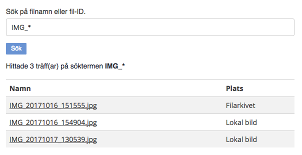

# Filsökaren

Skriptmodul framtagen för att redaktörer enkelt ska kunna hitta vart filer har laddats upp. Främst användbart när man har laddat upp en fil på en sida som man vid ett senare tillfälle inte hittar.

