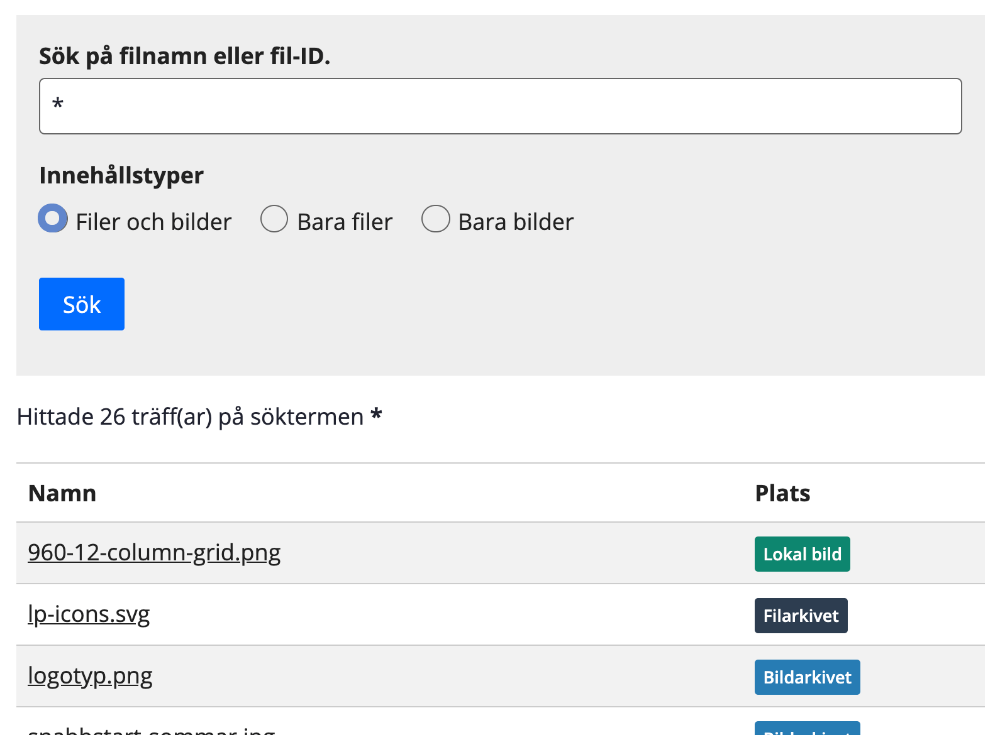

# Filsökaren

SiteVision-modul framtagen för att redaktörer enkelt ska kunna hitta vart filer har laddats upp. Främst användbart när man har laddat upp en fil på en sida som man vid ett senare tillfälle inte hittar. Modulen söker i sökindexet så filerna behöver vara indexerade för att kunna hittas.

## Installation

1. Gå in på [senaste släppta versionen][latest-release] och ladda ner certifikatet samt webapp-filen. Söker du en annan version finner du den under [Releases][releases].
2. Installera tilläggscertifikatet enligt [SiteVision:s hjälpsida om tilläggscertifikat][sitevision-help-addon-certificate].
3. Gå in under fliken *Tillägg* och installera webappen enligt [SiteVision:s hjälpsida om Tillägg][sitevision-help-addons].

## Utveckling

Utveckling sker med verktygsskripten i [sitevision/sitevision-scripts][sitevision-scripts] (dokumenterade i [sitevision/create-sitevision-app][create-sitevision-app]).

I det här projektet kommer du åt `sitevision-scripts` med `npx`. För att köra byggskriptet anropar du då `npx sitevision-scripts build`.

[releases]: https://github.com/hampusn/file-finder/releases
[latest-release]: https://github.com/hampusn/file-finder/releases/latest
[sitevision-help-addon-certificate]: https://help.sitevision.se/12706341.html
[sitevision-help-addons]: https://help.sitevision.se/12705868.html
[sitevision-scripts]: https://github.com/sitevision/sitevision-scripts
[create-sitevision-app]: https://github.com/sitevision/create-sitevision-app
